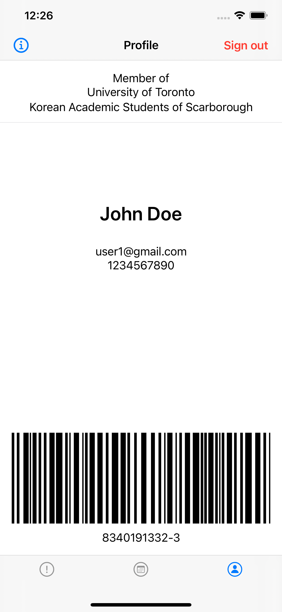

# UTKASS Official Mobile Application
Mobile application to provide members of UTKASS a platform to stay connected to announcements and events. The project was orignially created by [Ted Gitae Lim](https://github.com/gtaelim4) with the goal of providing an opportunity to gain experience with mobile development for executive members of UTKASS.

# Table of Contents
- [Supported Platforms](#supported-platforms)
- [Screenshots](#screenshots)
- [Description](#description)
- [Collaborators](#collaborators)
- [Privacy Policy](#privacy-policy)

## Supported Platforms
These are the current supported platforms for our mobile application:
- iOS 13.7
- Android 8.0 (Oreo)+

## Screenshots
### iOS

### Android

## Description
Both iOS and Android app features screens for announcement, calendar and profile post sign in.

Upon start of app user must login through their UofT email.
- If signing in for the first time, select "Forgot Password?" to reset the default password to your password.

After signing in you can view the one of the three screens. Announcement screen shows a list of announcements made starting from the most recent one. In the calendar screen you can navigate through a calendar at the top or view the list of events for a specific date. Profile screen displays personal information such as name, UofT email and student number. Since only verified members of UTKASS will be able to sign in, the profile page is proof that you are a member. Thus, present this page to access benefits of being a UTKASS member.

## Powered By
- Google Firebase - Backend database and user authentication

## Collaborators
- [Ted Gitae Lim](https://github.com/gtaelim4)

## Privacy Policy
- Click [here](https://utkass.github.io/privacypolicy) to view our privacy policy
